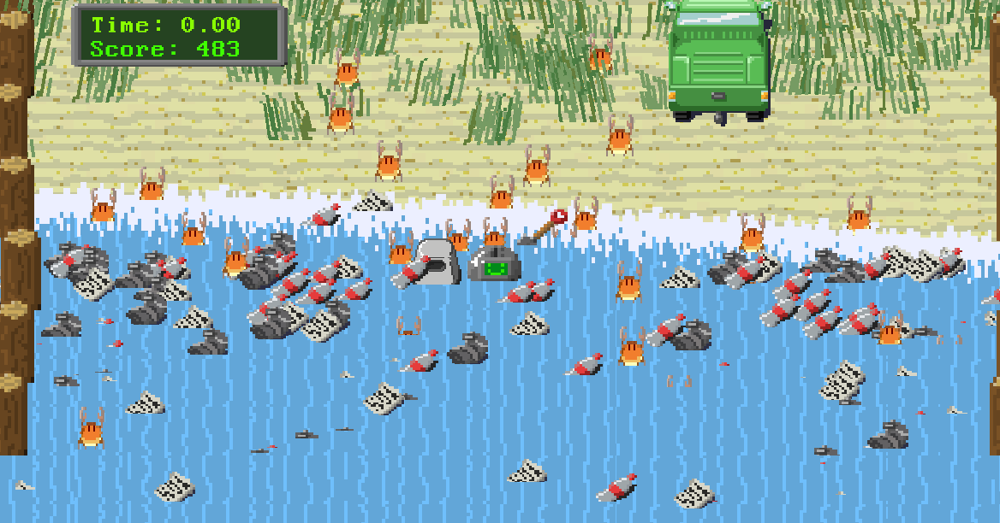

# Beach Game

You are a beach cleaning robot. Pick up litter from the beach, and put it in the bin. Use the spade to dig up buried items. Beware of the crabs!

## Controls

* WASD: Movement
* Space: Pickup/put down
* Dig: Pick up the shovel and stand near something needing digging.

# Checking out this repo:

As a warning, it requires as as-of-yet unpublished package version of the Unity Scriptable pipeline - this can be pulled as a git submodule, but be warned because it is _very_ large (about 2GB!).

